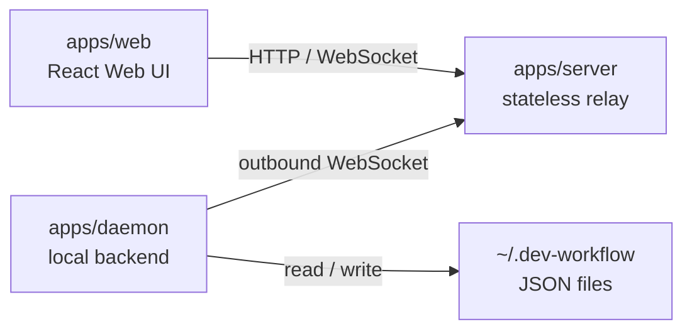
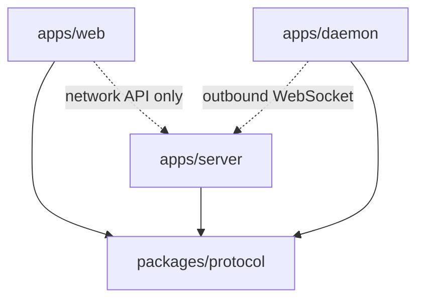

# App 与 Package 依赖关系分析

- 日期：2026-05-30
- 分支：`refactor/daemon`
- 状态：已调整为 web app + stateless relay server + local daemon；移动端和 Electron desktop app 已移除

## 结论摘要

当前架构已经收敛为：

- `apps/web`：React Web UI，只负责用户界面；运行时只通过 relay server 的 HTTP/WebSocket 访问数据。
- `apps/server`：无状态 relay server，只保存内存连接、pending query、pending command 状态，不落库。
- `apps/daemon`：本地后端和数据 owner，负责 `~/.dev-workflow` JSON 存储、workflow runtime、task/worktree/skill/settings 等本地能力。
- `packages/protocol`：唯一共享 package，保存 web/server/daemon 共用的 HTTP route、WebSocket path、message type、command type、query action 和 schema。

这个方向是合理的：数据和运行时逻辑集中在 daemon，server 不持久化数据，web 不直接持有本地执行能力。

## 运行时拓扑



说明：

- web 只连 relay server。
- daemon 不再启动本地 workflow HTTP/WebSocket server。
- daemon 只主动向 relay server 建立 outbound WebSocket 连接。
- server 负责转发 web 的 query/command，并把 daemon 的 task snapshot/event 广播给 web。

## 源码依赖图



说明：

- `apps/web` 不依赖 daemon 源码，运行时只访问 relay server。
- `apps/server` 不读写本地 workflow/task 数据，只向 daemon 转发 query/command。
- `apps/daemon` 不依赖 daemon-owned package；本地业务逻辑在 daemon 内部。
- `packages/protocol` 是唯一共享 package，用于协议常量、schema 和 route/path 定义。

## Daemon 内部结构

```txt
apps/daemon/src/
  index.ts
  diagnostics.ts
  services/
    settingsService.ts
    skillService.ts
    systemService.ts
    taskService.ts
    workflowService.ts
    workfolderService.ts
  repositories/
  runtime/
  relay/
    client.ts
    state.ts
    taskSnapshots.ts
    commandHandler.ts
    queryHandler.ts
```

### `services/`

业务编排层，按职责拆分。

- `workflowService.ts`：workflow CRUD、激活、显示/隐藏。
- `taskService.ts`：task state/output/delete/worktree/upload。
- `workfolderService.ts`：workfolder 增删查。
- `settingsService.ts`：workflow config、AI backend、AI API profile。
- `skillService.ts`：skill 生成、保存、删除、导入。
- `systemService.ts`：打开本地路径等系统操作。

### `repositories/`

JSON 文件存储层。

- config
- workflows
- workfolders
- task state
- skills

默认存储目录是 `~/.dev-workflow`，可通过 `DEV_WORKFLOW_HOME` 覆盖。这一层应该只负责数据读写，不反向依赖 runtime。

### `runtime/`

workflow 执行层。

- LangGraph runtime
- Claude/Codex adapter
- worktree helper
- workflow run state 更新

它属于 daemon 私有实现，不需要再放在 `packages`。

### `relay/`

daemon 到 relay server 的 outbound client。

- `client.ts`：WebSocket 生命周期、重连、metadata sync。
- `state.ts`：daemon identity、relay URL、socket 和已知 task 映射。
- `taskSnapshots.ts`：task snapshot 构建、bootstrap、event 后同步快照。
- `commandHandler.ts`：处理 server 发来的 workflow command。
- `queryHandler.ts`：处理 server 发来的 daemon data query。

当前 relay client 直接调用 daemon 的 `services/*` 和 `runtime/*`，不再通过本地 HTTP/WebSocket 调 daemon 自己。

### `diagnostics.ts`

可选诊断入口。只有设置 `DAEMON_DIAGNOSTICS_PORT` 时才启动 `GET /health`，它不是业务 API，也不参与 web/server/daemon 数据流。

## App / Package 合理性评估

| 模块 | 评分 | 说明 |
| --- | --- | --- |
| `apps/web` | 好 | Web UI 独立，运行时只通过 relay server API 访问数据，协议字符串来自 `packages/protocol` |
| `apps/daemon` | 好 | 本地后端 owner，数据、runtime、service、repository、relay client 都在 daemon 内部 |
| `apps/server` | 好 | stateless relay，依赖简单，不持久化业务数据 |
| `packages/protocol` | 好 | 唯一共享 package，边界清晰 |

## 已处理的设计问题

1. daemon 本地 workflow HTTP/WebSocket server 已移除。
2. `relay/client.ts` 已拆分为 connection、state、task snapshot、command handler、query handler 模块。
3. web/server/daemon 已共用 `packages/protocol` 中的 route、WebSocket path、message type、command type 和 query action。
4. daemon 不再依赖 Express；可选 diagnostics 使用 Node 内置 HTTP。
5. daemon 内部测试已移动到 `apps/daemon`。

这些改动让 `apps/web`、`apps/server`、`apps/daemon`、`packages/protocol` 的边界更清晰。

## 建议的后续步骤

1. 补充 daemon relay command/query handler 的单元测试。
2. 根据实际运行情况补充 server-daemon-web relay 集成测试。
3. 后续新增 HTTP route、WebSocket message、daemon query/action 时先更新 `packages/protocol`。

## 验证方式

架构调整后建议运行：

```sh
pnpm build:protocol
pnpm build:server
pnpm build:daemon
pnpm build:web
pnpm test:protocol
pnpm test:daemon
pnpm test:web
```
