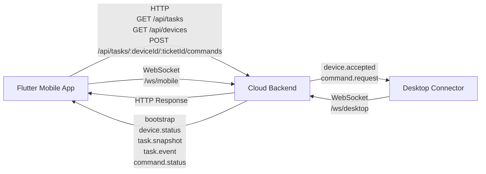
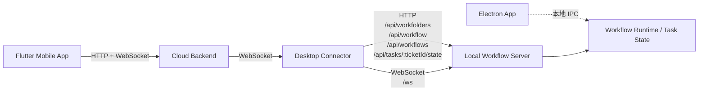
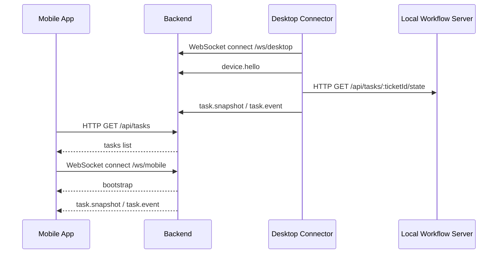
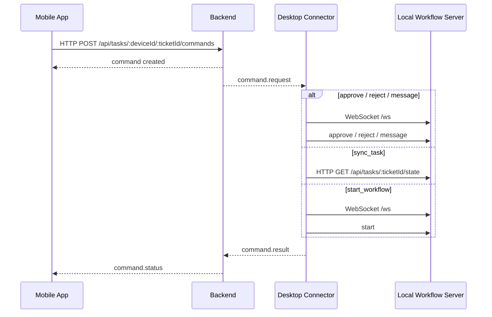

# 当前 Mobile / Backend / Desktop 通信图

本文基于当前仓库代码，描述现在这套 `Mobile App -> Backend -> Desktop` 的实际通信方式。

## 结论

当前不是纯 HTTP，也不是纯 WebSocket，而是混合模式：

- `Mobile App <-> Backend`：`HTTP + WebSocket`
- `Desktop Connector <-> Backend`：`WebSocket`
- `Desktop Connector <-> Local Workflow Server`：`HTTP + WebSocket`

需要注意的是，当前远程链路里，手机并不是直接连 Electron main process。  
它实际连到的是本地的 `desktop-connector` 和 `local workflow server` 这条链路。

## 三端实际通信图



## Desktop 端内部实际链路



## 当前通信职责

- `Mobile App`
  - 用 HTTP 拉任务列表和发送命令
  - 用 WebSocket 订阅实时状态

- `Backend`
  - 接收 mobile 的 HTTP 请求
  - 维护 `/ws/mobile` 和 `/ws/desktop`
  - 把 desktop 上报的任务状态推给 mobile
  - 把 mobile 发出的命令转发给 desktop connector

- `Desktop Connector`
  - 主动连接 backend 的 `/ws/desktop`
  - 从本地 server 拉取任务快照和配置
  - 通过本地 `/ws` 驱动 workflow session
  - 把本地 task 事件同步给 backend

## 主要消息流

### 1. Mobile 查看任务进度



### 2. Mobile 发送 action



## 当前协议划分

### `Mobile App <-> Backend`

- HTTP
  - 拉任务列表
  - 拉设备列表
  - 发送命令
- WebSocket
  - 接收 `bootstrap`
  - 接收 `device.status`
  - 接收 `task.snapshot`
  - 接收 `task.event`
  - 接收 `command.status`

### `Desktop Connector <-> Backend`

- WebSocket
  - 上行消息
    - `device.hello`
    - `task.snapshot`
    - `task.event`
    - `command.result`
  - 下行消息
    - `device.accepted`
    - `command.request`

### `Desktop Connector <-> Local Workflow Server`

- HTTP
  - 读取 workflow 配置
  - 读取 workfolders
  - 读取任务状态
  - 激活 workflow
- WebSocket
  - `start`
  - `approve`
  - `reject`
  - `message`
  - 接收本地 workflow 事件

## 一句话总结

当前代码里的实际通信方式是：

```txt
Mobile App -- HTTP + WebSocket --> Backend -- WebSocket --> Desktop Connector -- HTTP + WebSocket --> Local Workflow Server
```

如果只从“三端”角度看，可以简化成：

```txt
Mobile App -- HTTP + WebSocket --> Backend -- WebSocket --> Desktop
```
